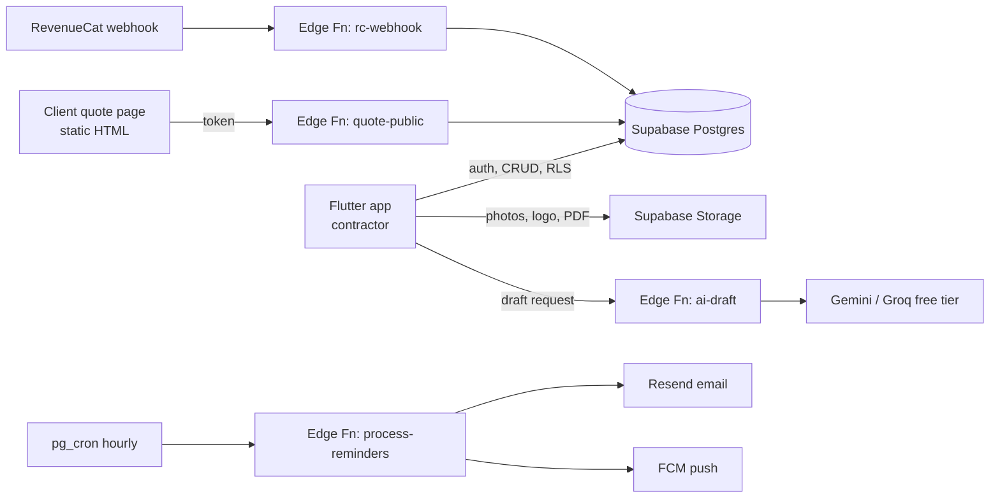
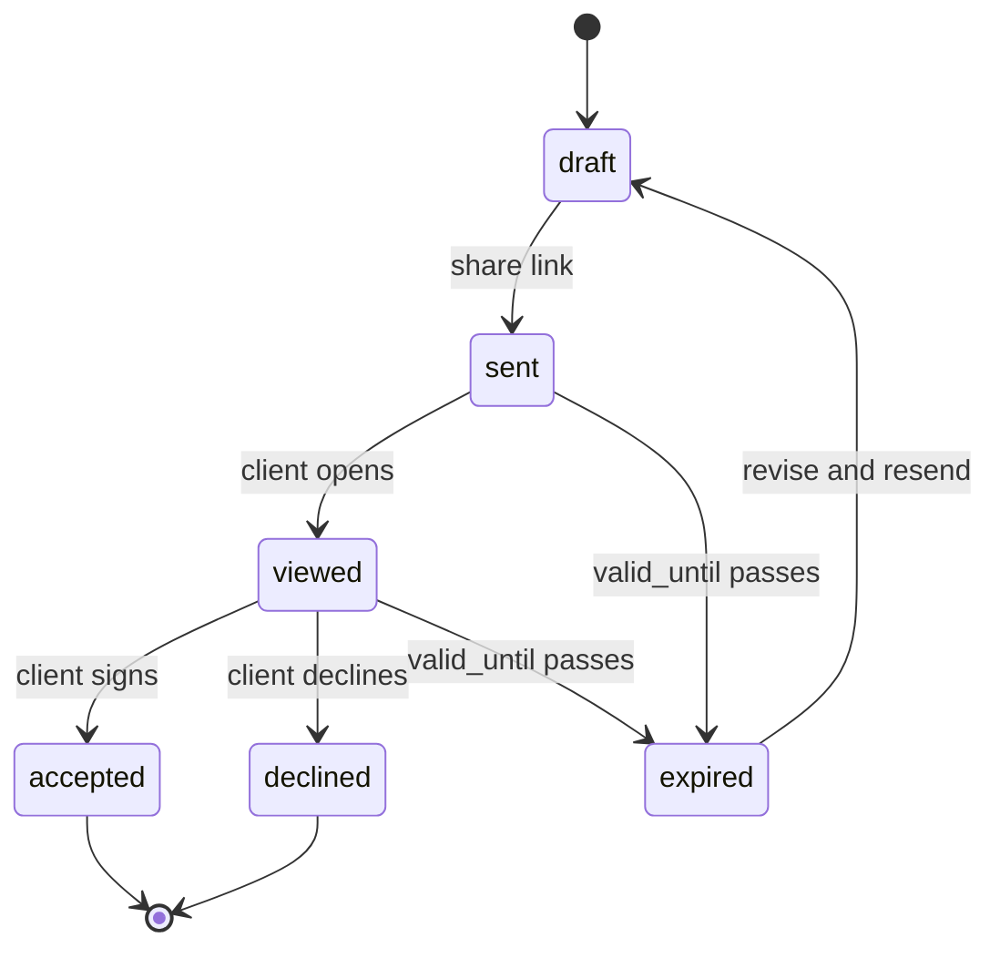
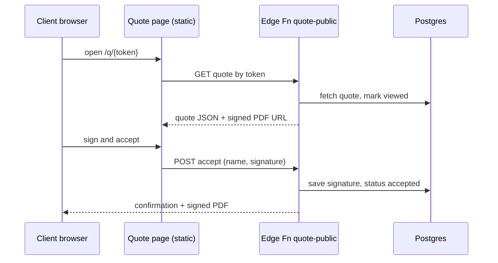
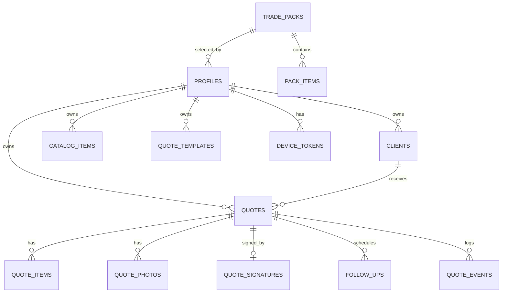

# QuoteForge — PRD & Database Design

2026-09-19 · @Someone

## 1. Overview

QuoteForge (working name) is a Flutter mobile app that lets a solo tradesperson or small service business send a branded, itemized quote PDF from the job site in under 5 minutes. The client can then view and e-sign it online, and the app follows up automatically. It runs entirely on free tiers: Flutter, Supabase, and free third-party services. There is no paid server.

### Problem

Solo contractors lose jobs because a competitor sends a quote in an hour while they take days. Today they quote from paper, WhatsApp messages, or Word templates at night. Existing tools such as Joist, Jobber, and Housecall Pro are drifting toward bigger teams, higher prices, and features solo users don't need.

### Positioning

"The fastest, simplest quote app for one-person trade businesses." The app does quoting and follow-up only. It does not do scheduling, CRM, dispatch, or payroll. It wins on speed, simplicity, reliability, and trade-specific templates, not on AI features.

### Target users

| Persona | Description | Main need |
| --- | --- | --- |
| Solo tradesperson (primary) | 1–3 person business (e.g. window cleaning, handyman, painting, electrical, interiors) quoting 5–30 jobs a month | Send a professional quote before leaving the site |
| Small consultant / agency | Freelancers quoting fixed-scope projects | Clean itemized proposal plus sign-off |
| End client (non-user) | Homeowner or business receiving the quote | Open the link on phone, understand the price, accept in one tap |

Launch will use **one trade pack** chosen after validation. The data model supports adding more packs without schema changes.

### Goals and success metrics

| Goal | Metric | Target |
| --- | --- | --- |
| Fast quoting | Median time from "New quote" to "Sent" | < 5 min |
| Client conversion | Sent quotes that the client opens | > 70% |
| Activation | New users who send 1+ quote in their first 7 days | > 40% |
| Revenue | Paying subscribers | 5 by month 2, 15 by month 4 (≈ $100–500 MRR) |
| Cost | Monthly infrastructure spend | $0 until \~500 active users |

## 2. Architecture (zero server cost)

Everything that must stay secret or run on a schedule lives in Supabase Edge Functions and pg\_cron. The heavy work, including PDF generation, voice-to-text, and image compression, happens on the phone. There is no VPS or Node server.



The contractor app talks to Supabase directly under row-level security. Clients never log in. They reach their quote only through an unguessable token handled by an Edge Function.

| Piece | Choice | Why / free limit (approximate, verify before launch) |
| --- | --- | --- |
| App | Flutter (Android first, iOS next) | Your core stack |
| State / arch | Riverpod + go\_router, feature-first folders | Simple, testable |
| Auth | Supabase Auth: email OTP + Google sign-in | Free, \~50K MAU |
| Database | Supabase Postgres + RLS | Free, 500 MB |
| Files | Supabase Storage (private buckets, signed URLs) | Free, 1 GB; compress photos to \~200 KB |
| PDF | `pdf` + `printing` packages, generated on device | Zero server compute |
| Voice notes | `speech_to_text` (on-device) | No transcription API cost |
| AI draft (optional) | Edge Function calling Gemini or Groq free tier | API key stays server-side; per-user monthly cap |
| Client quote page | Static HTML + supabase-js, hosted on Firebase Hosting or Cloudflare Pages | Free; loads fast on any phone, no app install |
| E-signature | Drawn signature (`signature` package on web page as canvas) + typed name, stored with timestamp, IP, and PDF hash | Basic evidence trail, no DocuSign cost |
| Email | Resend via Edge Function | Free, \~3,000/month, 100/day |
| Push | Firebase Cloud Messaging, sent from Edge Function | Free |
| Scheduler | pg\_cron + pg\_net calling `process-reminders` | Included in Supabase |
| Billing | Play / App Store subscriptions via RevenueCat | Free under \~$2.5K monthly tracked revenue |
| Sharing | WhatsApp / SMS / email share sheet (`share_plus`) with quote link + PDF | No SMS gateway cost |

**Free-tier caveat:** Supabase pauses free projects after about a week of inactivity. Keep a daily cron and real usage. Move to the $25/month Pro plan once MRR passes roughly $100.

## 3. MVP feature requirements

The MVP ships the P0 items only. P1 items come in the first month after launch if users ask for them.

| ID | Feature | Priority | Acceptance criteria |
| --- | --- | --- | --- |
| F1 | Onboarding and business profile | P0 | Sign in with email OTP or Google. Set business name, logo, phone, email, address, currency, tax label and rate (e.g. GST 18% or sales tax), tax ID, brand color, and trade pack. Done in under 2 min. |
| F2 | Price catalog | P0 | Trade pack pre-loads 20–40 common items. User can add, edit, and archive items with name, unit, price, and taxable flag. Items are searchable while building a quote. |
| F3 | Clients | P0 | Add a client inline while quoting, or import one from phone contacts. Fields: name, phone, email, address. |
| F4 | Quote builder | P0 | Add line items from the catalog or as custom items, with quantity, unit price, per-line tax, optional sections (e.g. "Kitchen"), discount (percent or flat), deposit percent, notes, terms, and validity date. Totals recalculate live. Auto-numbered (e.g. QF-0042). |
| F5 | Job photos | P0 | Attach up to 10 photos per quote, compressed on device. Each photo can be toggled to include in the PDF, with an optional caption. |
| F6 | Branded PDF | P0 | Generated on device in under 3 s. Includes logo, brand color, client details, sections, items, taxes, totals, deposit, terms, photos, and a signature block. Preview before sending. |
| F7 | Send and share | P0 | One tap opens the share sheet (WhatsApp, SMS, email) with a message template containing the quote link. The status moves to Sent. |
| F8 | Client quote page | P0 | Mobile-friendly web page opened by token. Shows the quote, a PDF download, and Accept or Decline buttons. The first open records Viewed and pushes a notification to the contractor. |
| F9 | E-signature acceptance | P0 | The client types a name, draws a signature, and ticks "I agree". The app stores the signature image, timestamp, IP, user agent, and SHA-256 hash of the PDF. The status moves to Accepted, and the contractor gets a push and an email. The signed PDF is regenerated with the signature. |
| F10 | Follow-up reminders | P0 | Configurable (default: 2 and 5 days after sending if not accepted). Emails go to the client if an email exists. The contractor gets a push nudge to follow up on WhatsApp. Reminders are cancelled on accept, decline, or expiry. |
| F11 | Dashboard | P0 | Quotes list filtered by status (Draft, Sent, Viewed, Accepted, Declined, Expired), with search. Shows this month's quoted value, accepted value, and win rate. |
| F12 | Duplicate / templates | P0 | Duplicate any quote, or save it as a reusable template. |
| F13 | AI draft from notes | P1 | Paste text or dictate voice notes. AI returns suggested line items matched to the user's catalog, plus a scope summary. The user always reviews before saving. Capped at 20/month on the free plan. |
| F14 | Quote to invoice | P1 | Convert an accepted quote into an invoice PDF. |
| F15 | Offline drafts | P1 | Create and edit drafts offline; they sync when back online. |

## 4. Core flows

### Quote lifecycle



Only the contractor can move a quote to draft or sent. Only the `quote-public` Edge Function can move it to viewed, accepted, or declined. A cron job handles expired.

### Create and send (contractor)

1. Tap New quote, then pick or add a client.
2. Add items from the catalog, as custom lines, or through AI draft (P1).
3. Add photos, then adjust the discount, deposit, and terms.
4. Preview the PDF. The app uploads it to Storage and generates a `public_token`.
5. Share through WhatsApp, SMS, or email. The status becomes sent and reminders are scheduled.

### Client view and accept



The Edge Function also cancels pending reminders and notifies the contractor by push and email.

### Follow-up reminders

The `process-reminders` job runs hourly. It picks up `follow_ups` rows that are due and still pending, where the quote is still sent or viewed. It emails the client and pushes the contractor, then marks each row sent. Every run is logged in `quote_events`.

## 5. Monetization

The model is freemium: the free plan lets users feel the speed, and the paywall hits when quoting becomes a habit. Launch pricing is $19/month, undercutting QuoteIQ's $29.99 entry plan. Raise it once reviews come in. For an India launch, use ₹499/month.

| Plan | Price | Limits |
| --- | --- | --- |
| Free | $0 | 3 sent quotes/month, "Made with QuoteForge" footer on PDF, 3 AI drafts/month, no reminders |
| Pro | $19/month or $159/year (₹499 / ₹3,999 in India) | Unlimited quotes, own branding only, automatic reminders, e-sign, templates, 50 AI drafts/month |

Enforcement happens server-side: a `can_send_quote()` check in Postgres and the plan on `profiles`, updated by the RevenueCat webhook. The client-side paywall is only UI.

The "Made with QuoteForge" footer on free PDFs doubles as the main organic growth loop, because every client who receives a quote sees it.

## 6. Scope, risks and milestones

### Out of scope for v1

Scheduling, job management, team accounts, online card payments, accounting sync (QuickBooks/Tally), blueprint takeoff, AI photo-based pricing, and a web dashboard for contractors.

### Risks

| Risk | Impact | Mitigation |
| --- | --- | --- |
| No distribution channel to reach contractors | High | Validate one niche and pre-sell 3 users before building past week 2; build in public in that niche's groups |
| Crowded market (Joist, QuoteIQ, Jobber) | High | Stay narrow: one trade, fastest flow, lowest price, no bloat |
| Supabase free project pauses or hits limits | Medium | Daily cron, photo compression, upgrade to Pro at \~$100 MRR |
| Free AI APIs change limits | Low | AI is optional (P1); the app is fully usable without it |
| E-signature legal weight varies by country | Medium | Store a full audit trail; describe it as "quote acceptance", not a legal contract service |
| Email deliverability | Medium | Verified sending domain on Resend; WhatsApp share is the primary channel |

### Open questions

- [ ] Which launch niche: a US micro-trade or an Indian vertical (e.g. interiors, solar)?
- [ ] Final product name and domain for the client quote page
- [ ] Android-only launch, or Android + iOS together?

### Milestones

| Week | Deliverable |
| --- | --- |
| 1 | Niche interviews (10), landing page, 3 pre-sale attempts |
| 2 | Supabase schema, RLS, auth, profile, and catalog |
| 3 | Clients, quote builder, on-device PDF |
| 4 | Storage, sharing, client quote page, `quote-public` function |
| 5 | E-signature, reminders (pg\_cron + Resend), push notifications |
| 6 | Dashboard, RevenueCat paywall, closed beta with 5–10 users |
| 7–8 | Fixes from beta, Play Store launch, AI draft (P1) |

## 7. Database design

The schema has 14 tables in the `public` schema. Every user-owned row carries `user_id` for simple RLS. Money is stored as `numeric(12,2)`, and quote totals are denormalized on `quotes` so the list screen needs one query.



### Tables

| Table | Purpose | Key columns |
| --- | --- | --- |
| `profiles` | One row per user (id = `auth.users.id`); business and branding settings | business\_name, logo\_path, brand\_color, currency, tax\_label, default\_tax\_rate, tax\_id, trade\_pack\_id, quote\_prefix, next\_quote\_number, default\_terms, default\_validity\_days, reminder\_days, plan, plan\_expires\_at |
| `trade_packs` | Global read-only list of trades | slug, name, is\_active |
| `pack_items` | Default catalog items per trade; copied into the user's catalog at onboarding | trade\_pack\_id, name, unit, default\_price, category |
| `catalog_items` | The user's own price list | user\_id, name, description, unit, unit\_price, category, is\_taxable, is\_archived |
| `clients` | The contractor's customers | user\_id, name, phone, email, address, notes |
| `quotes` | Quote header and denormalized totals | user\_id, client\_id, quote\_number, title, status, issue\_date, valid\_until, currency, discount\_type, discount\_value, subtotal, tax\_total, total, deposit\_percent, notes, terms, public\_token, pdf\_path, pdf\_hash, raw\_notes, ai\_generated, sent\_at, viewed\_at, accepted\_at, declined\_at |
| `quote_items` | Line items | quote\_id, user\_id, position, section, name, description, quantity, unit, unit\_price, tax\_rate, line\_total |
| `quote_photos` | Job photos attached to a quote | quote\_id, user\_id, storage\_path, caption, include\_in\_pdf, position |
| `quote_signatures` | Client acceptance evidence (one per quote) | quote\_id, signer\_name, signer\_email, signature\_path, ip\_address, user\_agent, document\_hash, signed\_at |
| `follow_ups` | Scheduled reminders | quote\_id, user\_id, scheduled\_for, status, sent\_at |
| `quote_events` | Audit and activity log | quote\_id, user\_id, type, meta (jsonb), created\_at |
| `quote_templates` | Reusable quote blueprints | user\_id, name, items (jsonb), notes, terms |
| `device_tokens` | FCM tokens for push | user\_id, token, platform |
| `ai_usage` | Monthly AI call counter for caps | user\_id, month, count |

### Enums

| Enum | Values |
| --- | --- |
| `quote_status` | draft, sent, viewed, accepted, declined, expired |
| `discount_type` | none, percent, flat |
| `follow_up_status` | pending, sent, cancelled, failed |
| `quote_event_type` | created, sent, viewed, reminder\_sent, accepted, declined, expired, pdf\_regenerated |
| `plan_tier` | free, pro |

### Storage buckets

| Bucket | Access | Path pattern |
| --- | --- | --- |
| `logos` | Private; owner read/write | `{user_id}/logo.png` |
| `quote-photos` | Private; owner read/write | `{user_id}/{quote_id}/{uuid}.jpg` |
| `quote-pdfs` | Private; owner read/write; clients get signed URLs from the Edge Function | `{user_id}/{quote_id}/v{n}.pdf` |
| `signatures` | Private; written only by the Edge Function (service role) | `{user_id}/{quote_id}/signature.png` |

## 8. SQL schema

Run these blocks in order in the Supabase SQL editor, or as one migration. Business rules live in the database: quote numbering, totals, the free-plan limit, reminder scheduling, and status protection. This keeps the Flutter app thin and hard to cheat.

### 8.1 Extensions and enums

```sql
-- Also enable pg_cron and pg_net in Dashboard > Database > Extensions
create extension if not exists pg_cron;
create extension if not exists pg_net;

create type quote_status as enum ('draft','sent','viewed','accepted','declined','expired');
create type discount_type as enum ('none','percent','flat');
create type follow_up_status as enum ('pending','sent','cancelled','failed');
create type quote_event_type as enum ('created','sent','viewed','reminder_sent','accepted','declined','expired','pdf_regenerated');
create type plan_tier as enum ('free','pro');
```

### 8.2 Tables

```sql
create table trade_packs (
  id uuid primary key default gen_random_uuid(),
  slug text unique not null,
  name text not null,
  description text,
  is_active boolean not null default true
);

create table pack_items (
  id uuid primary key default gen_random_uuid(),
  trade_pack_id uuid not null references trade_packs(id) on delete cascade,
  name text not null,
  description text,
  unit text not null default 'unit',
  default_price numeric(12,2) not null default 0,
  category text,
  position int not null default 0
);

create table profiles (
  id uuid primary key references auth.users(id) on delete cascade,
  business_name text,
  owner_name text,
  phone text,
  email text,
  address text,
  logo_path text,
  brand_color text not null default '#1E40AF',
  currency char(3) not null default 'USD',
  tax_label text not null default 'Tax',
  default_tax_rate numeric(5,2) not null default 0,
  tax_id text,
  trade_pack_id uuid references trade_packs(id),
  quote_prefix text not null default 'QF',
  next_quote_number int not null default 1,
  default_terms text,
  default_validity_days int not null default 14,
  reminder_days int[] not null default '{2,5}',
  plan plan_tier not null default 'free',
  plan_expires_at timestamptz,
  onboarded boolean not null default false,
  created_at timestamptz not null default now(),
  updated_at timestamptz not null default now()
);

create table clients (
  id uuid primary key default gen_random_uuid(),
  user_id uuid not null default auth.uid() references profiles(id) on delete cascade,
  name text not null,
  phone text,
  email text,
  address text,
  notes text,
  created_at timestamptz not null default now(),
  updated_at timestamptz not null default now()
);

create table catalog_items (
  id uuid primary key default gen_random_uuid(),
  user_id uuid not null default auth.uid() references profiles(id) on delete cascade,
  name text not null,
  description text,
  unit text not null default 'unit',
  unit_price numeric(12,2) not null default 0,
  category text,
  is_taxable boolean not null default true,
  is_archived boolean not null default false,
  created_at timestamptz not null default now(),
  updated_at timestamptz not null default now()
);

create table quotes (
  id uuid primary key default gen_random_uuid(),
  user_id uuid not null default auth.uid() references profiles(id) on delete cascade,
  client_id uuid references clients(id) on delete set null,
  quote_number text,
  title text,
  status quote_status not null default 'draft',
  issue_date date not null default current_date,
  valid_until date,
  currency char(3),
  discount_type discount_type not null default 'none',
  discount_value numeric(12,2) not null default 0 check (discount_value >= 0),
  subtotal numeric(12,2) not null default 0,
  discount_total numeric(12,2) not null default 0,
  tax_total numeric(12,2) not null default 0,
  total numeric(12,2) not null default 0,
  deposit_percent numeric(5,2) not null default 0 check (deposit_percent between 0 and 100),
  notes text,
  terms text,
  raw_notes text,
  ai_generated boolean not null default false,
  public_token uuid not null unique default gen_random_uuid(),
  pdf_path text,
  pdf_hash text,
  pdf_version int not null default 0,
  sent_at timestamptz,
  viewed_at timestamptz,
  accepted_at timestamptz,
  declined_at timestamptz,
  created_at timestamptz not null default now(),
  updated_at timestamptz not null default now(),
  unique (user_id, quote_number)
);

create table quote_items (
  id uuid primary key default gen_random_uuid(),
  quote_id uuid not null references quotes(id) on delete cascade,
  user_id uuid not null default auth.uid() references profiles(id) on delete cascade,
  catalog_item_id uuid references catalog_items(id) on delete set null,
  position int not null default 0,
  section text,
  name text not null,
  description text,
  quantity numeric(12,3) not null default 1 check (quantity > 0),
  unit text not null default 'unit',
  unit_price numeric(12,2) not null default 0,
  tax_rate numeric(5,2) not null default 0,
  line_total numeric(12,2) generated always as (round(quantity * unit_price, 2)) stored
);

create table quote_photos (
  id uuid primary key default gen_random_uuid(),
  quote_id uuid not null references quotes(id) on delete cascade,
  user_id uuid not null default auth.uid() references profiles(id) on delete cascade,
  storage_path text not null,
  caption text,
  include_in_pdf boolean not null default true,
  position int not null default 0,
  created_at timestamptz not null default now()
);

create table quote_signatures (
  id uuid primary key default gen_random_uuid(),
  quote_id uuid not null unique references quotes(id) on delete cascade,
  user_id uuid not null references profiles(id) on delete cascade,
  signer_name text not null,
  signer_email text,
  signature_path text not null,
  ip_address inet,
  user_agent text,
  document_hash text not null,
  signed_at timestamptz not null default now()
);

create table follow_ups (
  id uuid primary key default gen_random_uuid(),
  quote_id uuid not null references quotes(id) on delete cascade,
  user_id uuid not null references profiles(id) on delete cascade,
  scheduled_for timestamptz not null,
  status follow_up_status not null default 'pending',
  sent_at timestamptz,
  error text
);

create table quote_events (
  id bigint generated always as identity primary key,
  quote_id uuid not null references quotes(id) on delete cascade,
  user_id uuid not null references profiles(id) on delete cascade,
  type quote_event_type not null,
  meta jsonb not null default '{}',
  created_at timestamptz not null default now()
);

create table quote_templates (
  id uuid primary key default gen_random_uuid(),
  user_id uuid not null default auth.uid() references profiles(id) on delete cascade,
  name text not null,
  items jsonb not null default '[]',
  notes text,
  terms text,
  created_at timestamptz not null default now()
);

create table device_tokens (
  token text primary key,
  user_id uuid not null default auth.uid() references profiles(id) on delete cascade,
  platform text not null check (platform in ('android','ios')),
  updated_at timestamptz not null default now()
);

create table ai_usage (
  user_id uuid not null references profiles(id) on delete cascade,
  month date not null,
  count int not null default 0,
  primary key (user_id, month)
);
```

### 8.3 Indexes

```sql
create index quotes_user_status_idx on quotes (user_id, status, created_at desc);
create index quote_items_quote_idx on quote_items (quote_id, position);
create index quote_photos_quote_idx on quote_photos (quote_id, position);
create index clients_user_name_idx on clients (user_id, name);
create index catalog_user_idx on catalog_items (user_id) where not is_archived;
create index follow_ups_due_idx on follow_ups (scheduled_for) where status = 'pending';
create index quote_events_quote_idx on quote_events (quote_id, created_at desc);
```

### 8.4 Functions and triggers

```sql
-- Create a profile for every new auth user
create or replace function handle_new_user() returns trigger
language plpgsql security definer set search_path = public as $$
begin
  insert into profiles (id, email) values (new.id, new.email);
  return new;
end $$;

create trigger on_auth_user_created after insert on auth.users
for each row execute function handle_new_user();

-- Generic updated_at
create or replace function touch_updated_at() returns trigger language plpgsql as $$
begin new.updated_at := now(); return new; end $$;

create trigger clients_touch before update on clients for each row execute function touch_updated_at();
create trigger catalog_touch before update on catalog_items for each row execute function touch_updated_at();

-- Users cannot change their own plan or reset numbering
create or replace function guard_profile_update() returns trigger language plpgsql as $$
begin
  if coalesce(auth.role(), '') = 'authenticated' then
    new.plan := old.plan;
    new.plan_expires_at := old.plan_expires_at;
    new.next_quote_number := greatest(new.next_quote_number, old.next_quote_number);
  end if;
  new.updated_at := now();
  return new;
end $$;

create trigger profiles_guard before update on profiles
for each row execute function guard_profile_update();

-- Free plan: 3 sent quotes per calendar month
create or replace function can_send_quote(p_user uuid) returns boolean
language sql stable security definer set search_path = public as $$
  select (p.plan = 'pro' and (p.plan_expires_at is null or p.plan_expires_at > now()))
      or (select count(*) from quotes q
          where q.user_id = p_user and q.sent_at >= date_trunc('month', now())) < 3
  from profiles p where p.id = p_user;
$$;

-- Numbering and defaults on insert
create or replace function prepare_new_quote() returns trigger
language plpgsql security definer set search_path = public as $$
declare p profiles%rowtype;
begin
  if new.client_id is not null and not exists (
    select 1 from clients c where c.id = new.client_id and c.user_id = new.user_id) then
    raise exception 'INVALID_CLIENT';
  end if;
  update profiles set next_quote_number = next_quote_number + 1
  where id = new.user_id returning * into p;   -- row lock makes numbering race-safe
  new.quote_number := p.quote_prefix || '-' || lpad((p.next_quote_number - 1)::text, 4, '0');
  new.currency := coalesce(new.currency, p.currency);
  new.valid_until := coalesce(new.valid_until, current_date + p.default_validity_days);
  new.terms := coalesce(new.terms, p.default_terms);
  new.status := 'draft';
  return new;
end $$;

create trigger quotes_prepare before insert on quotes
for each row execute function prepare_new_quote();

-- Only the server may set viewed/accepted/declined/expired; enforce free limit on send
create or replace function guard_quote_update() returns trigger language plpgsql as $$
begin
  if coalesce(auth.role(), '') = 'authenticated' and new.status is distinct from old.status then
    if new.status in ('viewed','accepted','declined','expired') then
      raise exception 'STATUS_SERVER_ONLY';
    end if;
    if new.status = 'sent' then
      if old.sent_at is null and not can_send_quote(old.user_id) then
        raise exception 'FREE_LIMIT_REACHED';
      end if;
      new.sent_at := coalesce(old.sent_at, now());
    end if;
  end if;
  new.updated_at := now();
  return new;
end $$;

create trigger quotes_guard before update on quotes
for each row execute function guard_quote_update();

-- Totals: discount applied before tax, tax pro-rated
create or replace function recalc_quote_totals(p_quote_id uuid) returns void
language plpgsql security definer set search_path = public as $$
declare
  q record;
  v_sub numeric; v_tax numeric; v_disc numeric; v_ratio numeric;
begin
  select discount_type, discount_value into q from quotes where id = p_quote_id;
  if not found then return; end if;
  select coalesce(sum(line_total), 0), coalesce(sum(line_total * tax_rate / 100), 0)
    into v_sub, v_tax from quote_items where quote_id = p_quote_id;
  v_disc := case q.discount_type
              when 'percent' then round(v_sub * q.discount_value / 100, 2)
              when 'flat' then least(q.discount_value, v_sub)
              else 0 end;
  v_ratio := case when v_sub > 0 then (v_sub - v_disc) / v_sub else 1 end;
  update quotes
     set subtotal = v_sub,
         discount_total = v_disc,
         tax_total = round(v_tax * v_ratio, 2),
         total = v_sub - v_disc + round(v_tax * v_ratio, 2)
   where id = p_quote_id;
end $$;

create or replace function items_changed() returns trigger language plpgsql as $$
begin
  perform recalc_quote_totals(coalesce(new.quote_id, old.quote_id));
  return null;
end $$;

create trigger quote_items_totals after insert or update or delete on quote_items
for each row execute function items_changed();

create or replace function discount_changed() returns trigger language plpgsql as $$
begin perform recalc_quote_totals(new.id); return null; end $$;

create trigger quotes_discount_totals after update of discount_type, discount_value on quotes
for each row execute function discount_changed();

-- Log status changes, schedule or cancel reminders
create or replace function on_quote_status_change() returns trigger
language plpgsql security definer set search_path = public as $$
declare d int; v_days int[];
begin
  if new.status is not distinct from old.status or new.status = 'draft' then
    return null;
  end if;
  insert into quote_events (quote_id, user_id, type)
  values (new.id, new.user_id, new.status::text::quote_event_type);

  if new.status = 'sent' and old.status in ('draft','expired') then
    select reminder_days into v_days from profiles where id = new.user_id;
    foreach d in array coalesce(v_days, '{}') loop
      insert into follow_ups (quote_id, user_id, scheduled_for)
      values (new.id, new.user_id, now() + make_interval(days => d));
    end loop;
  elsif new.status in ('accepted','declined','expired') then
    update follow_ups set status = 'cancelled'
    where quote_id = new.id and status = 'pending';
  end if;
  return null;
end $$;

create trigger quotes_status_change after update of status on quotes
for each row execute function on_quote_status_change();

-- Onboarding: copy a trade pack into the user's catalog
create or replace function seed_catalog(p_pack uuid) returns void
language sql security invoker as $$
  insert into catalog_items (user_id, name, description, unit, unit_price, category)
  select auth.uid(), name, description, unit, default_price, category
  from pack_items where trade_pack_id = p_pack order by position;
  update profiles set trade_pack_id = p_pack where id = auth.uid();
$$;
```

### 8.5 Row-level security

```sql
alter table trade_packs enable row level security;
alter table pack_items enable row level security;
alter table profiles enable row level security;
alter table clients enable row level security;
alter table catalog_items enable row level security;
alter table quotes enable row level security;
alter table quote_items enable row level security;
alter table quote_photos enable row level security;
alter table quote_signatures enable row level security;
alter table follow_ups enable row level security;
alter table quote_events enable row level security;
alter table quote_templates enable row level security;
alter table device_tokens enable row level security;
alter table ai_usage enable row level security;

create policy packs_read on trade_packs for select to authenticated using (is_active);
create policy pack_items_read on pack_items for select to authenticated using (true);

create policy profile_read on profiles for select to authenticated using (id = auth.uid());
create policy profile_update on profiles for update to authenticated
  using (id = auth.uid()) with check (id = auth.uid());

create policy own_clients on clients for all to authenticated
  using (user_id = auth.uid()) with check (user_id = auth.uid());
create policy own_catalog on catalog_items for all to authenticated
  using (user_id = auth.uid()) with check (user_id = auth.uid());
create policy own_quotes on quotes for all to authenticated
  using (user_id = auth.uid()) with check (user_id = auth.uid());
create policy own_templates on quote_templates for all to authenticated
  using (user_id = auth.uid()) with check (user_id = auth.uid());
create policy own_tokens on device_tokens for all to authenticated
  using (user_id = auth.uid()) with check (user_id = auth.uid());
create policy own_follow_ups on follow_ups for all to authenticated
  using (user_id = auth.uid()) with check (user_id = auth.uid());

-- Child rows must point at the user's own quote
create policy own_items on quote_items for all to authenticated
  using (user_id = auth.uid())
  with check (user_id = auth.uid() and exists (
    select 1 from quotes q where q.id = quote_id and q.user_id = auth.uid()));
create policy own_photos on quote_photos for all to authenticated
  using (user_id = auth.uid())
  with check (user_id = auth.uid() and exists (
    select 1 from quotes q where q.id = quote_id and q.user_id = auth.uid()));

-- Read-only for the owner; written by triggers or Edge Functions (service role)
create policy signatures_read on quote_signatures for select to authenticated using (user_id = auth.uid());
create policy events_read on quote_events for select to authenticated using (user_id = auth.uid());
create policy events_insert on quote_events for insert to authenticated
  with check (user_id = auth.uid() and type in ('created','pdf_regenerated'));
create policy ai_usage_read on ai_usage for select to authenticated using (user_id = auth.uid());
```

### 8.6 Storage

```sql
insert into storage.buckets (id, name, public) values
  ('logos', 'logos', false),
  ('quote-photos', 'quote-photos', false),
  ('quote-pdfs', 'quote-pdfs', false),
  ('signatures', 'signatures', false);

-- First folder in the path must be the user's id
create policy owner_files on storage.objects for all to authenticated
  using (bucket_id in ('logos','quote-photos','quote-pdfs')
         and (storage.foldername(name))[1] = auth.uid()::text)
  with check (bucket_id in ('logos','quote-photos','quote-pdfs')
         and (storage.foldername(name))[1] = auth.uid()::text);

create policy owner_reads_signatures on storage.objects for select to authenticated
  using (bucket_id = 'signatures' and (storage.foldername(name))[1] = auth.uid()::text);
```

### 8.7 Scheduled jobs

```sql
-- Store secrets once: select vault.create_secret('https://<project>.supabase.co/functions/v1', 'functions_url');
--                      select vault.create_secret('<random-string>', 'cron_secret');

select cron.schedule('expire-quotes', '15 0 * * *', $$
  update public.quotes set status = 'expired'
  where status in ('sent','viewed') and valid_until < current_date;
$$);

select cron.schedule('process-reminders', '0 * * * *', $$
  select net.http_post(
    url := (select decrypted_secret from vault.decrypted_secrets where name = 'functions_url') || '/process-reminders',
    headers := jsonb_build_object(
      'Content-Type', 'application/json',
      'x-cron-secret', (select decrypted_secret from vault.decrypted_secrets where name = 'cron_secret')),
    body := '{}'::jsonb);
$$);
```

The daily expiry job also keeps the free-tier project active, since Supabase pauses projects with no activity.

### 8.8 Edge Functions

| Function | Called by | Does |
| --- | --- | --- |
| `quote-public` | Client quote page | GET by token: returns quote, items, business branding, and a 1-hour signed PDF URL; sets viewed on first open. POST accept: uploads signature, inserts `quote_signatures`, sets accepted. POST decline: sets declined with an optional reason in `quote_events.meta`. Rejects expired quotes. |
| `process-reminders` | pg\_cron hourly (checks `x-cron-secret`) | Sends due `follow_ups` by Resend email and FCM push, then marks them sent or failed |
| `ai-draft` | App (user JWT) | Checks and increments `ai_usage`, calls the LLM with the user's catalog, returns JSON line items |
| `rc-webhook` | RevenueCat | Verifies the auth header, then updates `profiles.plan` and `plan_expires_at` |
| `notify-owner` | Called internally by `quote-public` | Sends push and email to the contractor on viewed, accepted, or declined |
